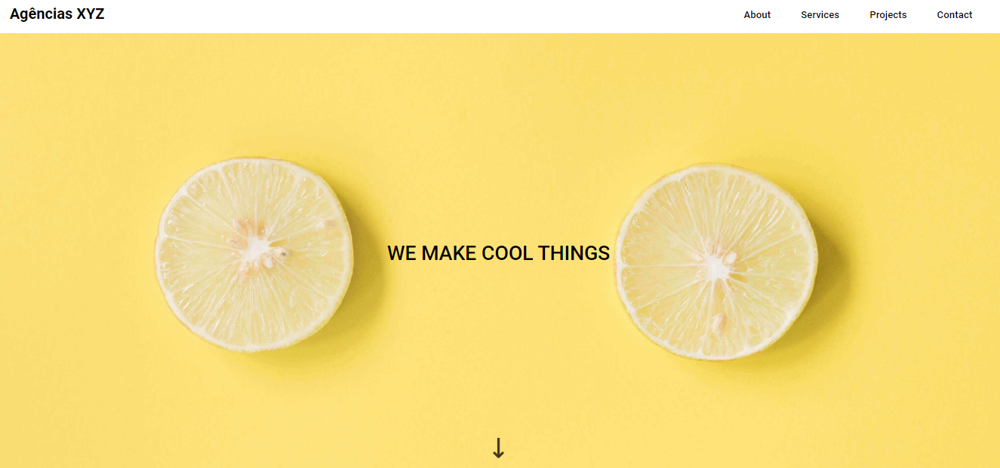

# Landing Page

>Utilizando CSS Grid

Projeto construído como desafio no módulo de CSS Avançado do curso de Front-end do DEVQUEST.

[&#x1F517; Clique aqui para acessar o projeto](https://github.com/alysson-leite/landing-page-com-grid)

## Tecnologias &#x1F4BB;

- HTML
- CSS
- Git e Github
- Figma

## O que aprendi

Neste projeto, desenvolvi melhor minhas habilidades em CSS, utilizando display Grid para compor a página.

## Contato &#x1F4E7;

alysson_leite@yahoo.com.br